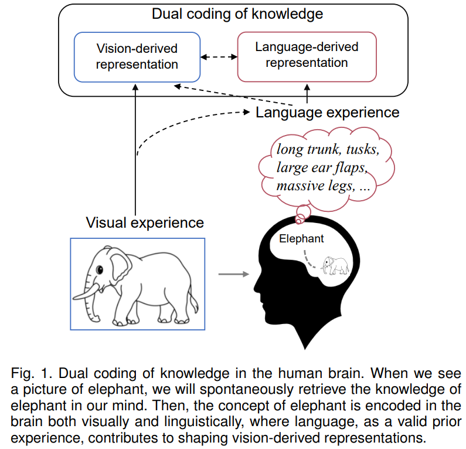
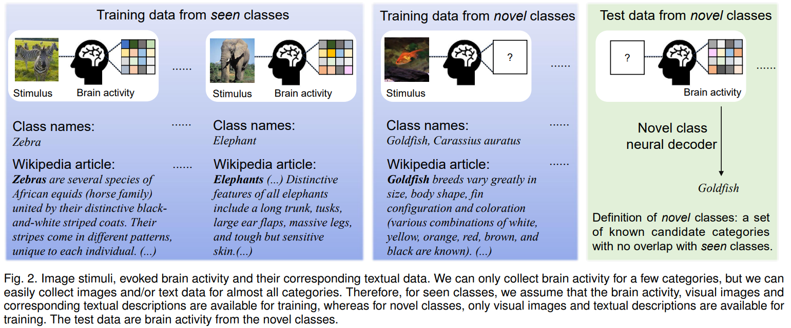
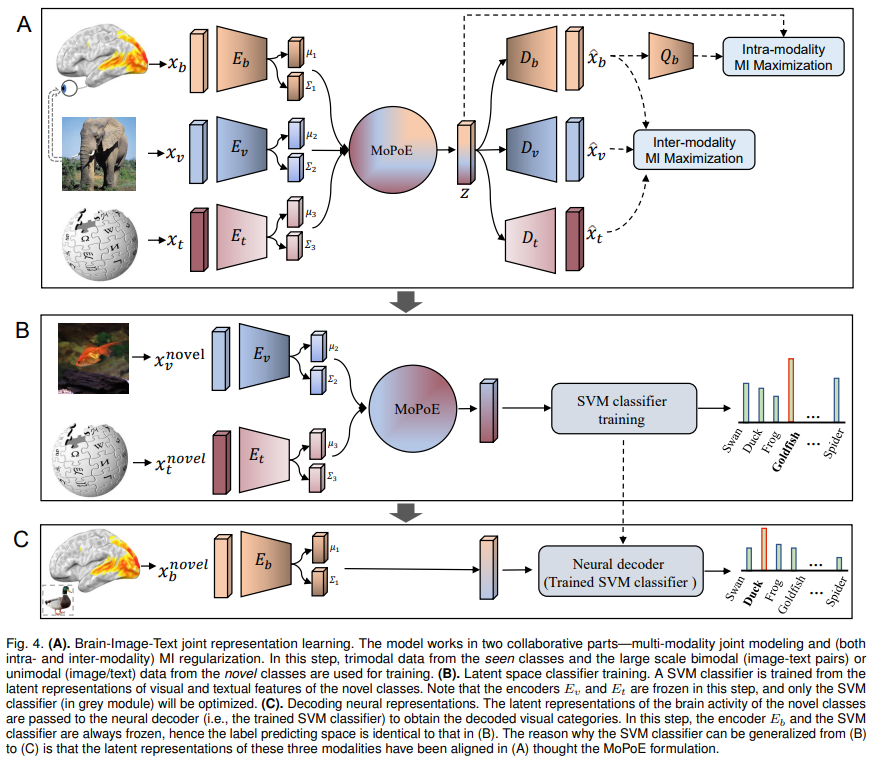
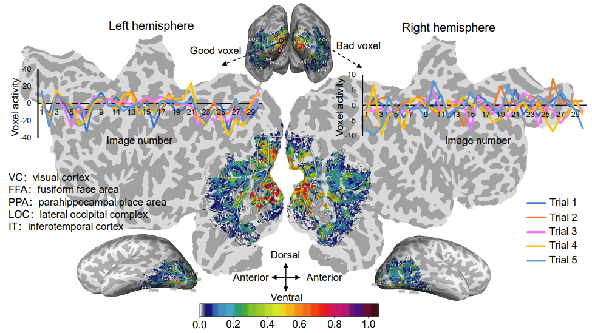

# BraVL
This is the official code for the paper "Decoding Visual Neural Representations by Multimodal Learning of Brain-Visual-Linguistic Features, IEEE Transactions on Pattern Analysis and Machine Intelligence (TPAMI 2023)" (https://ieeexplore.ieee.org/document/10089190).
> - Authors: Changde Du, Kaicheng Fu, Jinpeng Li, Huiguang He






## Preliminaries

This code was developed and tested with:
- Python version 3.7.0
- PyTorch version 1.9.0
- CUDA version 11.2
- The conda environment defined in `environment.yml`

First, set up the conda enviroment as follows:
```bash
conda env create -f environment.yml  # create conda env
conda activate BraVL                # activate conda env
```
## Download data
Second, download the pre-processed trimodal data from https://figshare.com/articles/dataset/BraVL/17024591, unzip them, and put them at "./data" directory:
```bash
unzip DIR-Wiki.zip -d BraVL_fMRI/data/
unzip GOD-Wiki.zip -d BraVL_fMRI/data/
unzip ThingsEEG-Text.zip -d BraVL_EEG/data/
```
Note that, the raw (image and brain fMRI/EEG) data are not included here because they are too large. Raw ImageNet images and brain fMRI data can be downloaded from the corresponding official site. We provide python scripts for feature extraction and data preprocessing.

## Experiments

Experiments can be started by running the `job_trimodal` script.


### running BraVL on the Image-Text-fMRI datasets
```
cd BraVL_fMRI
bash job_trimodal
```
### running BraVL on the Image-Text-EEG datasets
```
cd BraVL_EEG
bash job_trimodal
```

If you have any questions about the code or the paper, we are happy to help!
